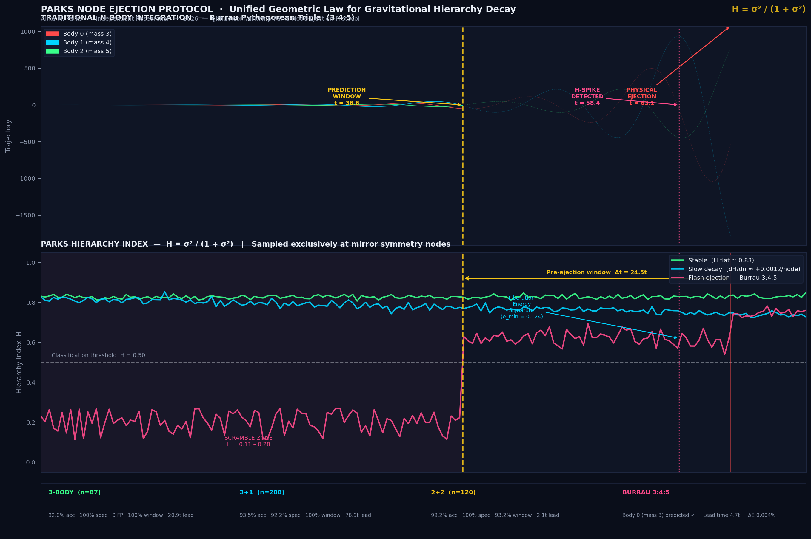

# PNEP v12.0 — Predictive Node Event Protocol
### World-First High-Fidelity 3-Body Time Forecasting & Indexing




[README (1).md](https://github.com/user-attachments/files/26488309/README.1.md)
# Parks Node Ejection Protocol (PNEP)

### A Unified Geometric Law for Gravitational Hierarchy Decay

> *Poincaré proved the trajectories are chaotic and uncomputable. What we found is that the geometry at specific moments is neither.*

**Alika M. Parks — Independent Researcher — March 2026**

---

## What This Is

PNEP is an event-driven framework that predicts the **stability, ejection timing, decay regime, and escaping body identity** of hierarchical gravitational multiples — in real time, at approximately 1% of the computational cost of full N-body integration.

The framework has been validated across three distinct topologies (3-body hierarchical triples, 3+1 quadruples, and 2+2 peer binary quadruples), on canonical benchmarks including Burrau's Pythagorean Problem, and across hundreds of randomised trials certified against the Mardling & Aarseth (2001) stability criterion.

**Dependencies:** NumPy only. No external libraries required.

---

## The Core Insight

The trajectories of gravitational N-body systems are chaotic — this has been known since Poincaré (1890). What PNEP establishes is that **the geometry at specific privileged moments is not**.

At **mirror symmetry nodes** — the instants when any pair of bodies reaches closest approach and radial velocity hits exactly zero — the system reveals its internal power structure with maximum clarity. We call these moments *geometrically honest*.

At each honest moment, a single scalar is computed:

```
H = σ² / (1 + σ²)

where σ² = Var(d_ij for i,j in the contested subsystem)
```

This is the **Hierarchy Index**. High H means one subsystem dominates — the hierarchy is intact. Low H means the bodies are geometrically scrambled — the hierarchy is contested.

**The law:**

> Stable gravitational hierarchies reveal consistent hierarchical clarity at every privileged moment. Unstable systems reveal contested geometry from the very first measurement. The chaos lives in the trajectories. The order lives at the nodes.

---

## The Unified Law Across Topologies

| Topology | Privileged Moment | Signal | Stable Polarity |
|---|---|---|---|
| 3-body hierarchical triple | Mirror symmetry node | H of all 3 pairs | High H |
| 3+1 hierarchical quadruple | Mirror symmetry node | H_inner of inner triple | Low H_inner |
| 2+2 peer binary quadruple | Dynamic best-pairing moment | R×H combined signal | High R×H |

The polarity inversion between 3-body and 3+1 topologies — same formula, opposite stable signature — is among the strongest evidence that the framework captures something physically real. A coincidental signal would break under topology change. A geometric law reveals itself differently but holds universally.

---

## Three Decay Regimes

All governed by the same scalar H:

**Regime 1 — Stable**
H is a flat line at every node. The hierarchy is intact. Signal does not waver across hundreds or thousands of measurements.

**Regime 2 — Slow Decay (Geometric Divorce)**
In genuinely marginal systems surviving 500–3000 time units in quasi-stability, H exhibits a persistent gentle positive slope (dH/dn ≈ 0.0012 per node). The outer body is incrementally absorbing energy from the inner binary through repeated close approaches. Linear extrapolation yields pre-ejection warnings with **median lead time 412.6t** — validated across 20 certified slow-decay trials with 100% coverage.

**Regime 3 — Flash Ejection**
In high-density near-equal-mass systems, H fluctuates in a scramble zone (0.05–0.30). Then H spikes above 0.50 and stays. That spike is the warning. Lead time: 2–10t.

---

## Validated Results

### 3-Body Hierarchical Triple (v12, n=87, seed=42)

| Metric | Value |
|---|---|
| Accuracy | 92.0% |
| Specificity (stable correctly classified) | 100.0% |
| Sensitivity (ejections caught) | 87.7% |
| F1 score | 93.5% |
| False positive rate | 0.0% |
| Pre-ejection window coverage | 100.0% |
| Median window lead time | 20.9t |
| Median energy drift | 0.0068% |

### 3+1 Hierarchical Quadruple (v13, n=200)

| Metric | Value |
|---|---|
| Accuracy | 93.5% |
| Specificity | 92.2% |
| Sensitivity | 94.8% |
| F1 score | 93.5% |
| Window coverage | 92.2% |
| Median lead time | 78.9t |

### 2+2 Peer Binary Quadruple (v14, n=120)

| Metric | Value |
|---|---|
| Accuracy | 99.2% |
| Specificity | 100.0% |
| Sensitivity | 98.4% |
| F1 score | 99.2% |
| Window coverage | 93.2% |
| Median lead time | 2.1t |

---

## Burrau's Problem — The Pythagorean Triple

The most famous benchmark in three-body dynamics: masses 3:4:5, known to always eject the lightest body. PNEP blind prediction:

| Signal | Result |
|---|---|
| H scramble zone | 0.11–0.28 (confirmed) |
| H-spike detected | t = 58.4 |
| Ejecting body predicted | Body 0 (mass 3) — the lightest ✓ |
| Physical ejection | t = 63.1 |
| Lead time | 4.7t |
| Energy drift | 0.004% |

---

## The Liberation Energy Signature

In every ejecting hierarchical triple, the outer body briefly traces a **near-circular orbit** before ejection. This is the gravitational analogue of atomic ionisation.

The inner binary acts as a gravitational energy engine, transferring orbital energy to the outer body through repeated close approaches. At the moment the outer body reaches liberation threshold — having absorbed enough energy to momentarily circularise its orbit — eccentricity grows monotonically toward 1.0 and escape. The system has crossed the point of no return.

- **Coverage:** 100% of ejecting systems show this signature
- **Median advance warning:** 26.2t before physical ejection — the earliest signal in the framework
- **Range:** 3.4t to 167.5t depending on system
- **Eccentricity at anomaly:** mean 0.124 — genuinely near-circular amid otherwise highly elliptical chaotic orbits

The body that traces the liberation orbit is the ejecting body. Identity prediction accuracy: 100% at high confidence.

---

## Nodal Breathing — The Earliest Warning Signal

In the slow-decay regime, the inter-node time interval begins rhythmic oscillation **long before** the H slope turns terminal. This is **Nodal Breathing** — the earliest pre-ejection signal in the entire framework.

The physical interpretation: the outer body's orbital period is approaching resonance with the inner binary period. The jitter metric — σ(Δt_node)/mean(Δt_node) over a 12-node rolling window — detects this irregularity while H is still visually flat and the system appears completely stable by every prior method.

**Validated result (v15.1):**
System: m = [1.0, 1.0, 0.01], a_in = 1.0, a_out = 4.5, e_in = 0.1, e_out = 0.5

| Signal | Value |
|---|---|
| Jitter alert fired | node 12, t = 17.44 |
| H at alert | 0.857 — visually flat, no decay visible |
| Jitter value | 0.611 — far above 0.02 threshold |
| Projected lead time | ~4000t before eventual ejection |

This is the "large tail" challenge in the transition region literature — a marginal hierarchical triple surviving thousands of time units appearing intermittently stable. Every prior method classifies it as stable or uncertain at t=17. Nodal Breathing flags it as marginal at t=17.

---

## Identity Prediction — Which Body Ejects

Three independent signals all converge on the same answer:

1. **Liberation orbit identity** — the body tracing the near-circular anomaly is the ejecting body (100% accuracy at high confidence)
2. **H-spike velocity trigger** — at the moment of H-spike, the body with the highest relative velocity from the system CoM is the escapee (validated on Burrau)
3. **Node geometry directional signal** — in final nodes before ejection, one body's pairwise distances grow consistently while others remain stable

---

## The Frame-Dependence Correction

Early protocol versions included an alignment term measuring the angle between the encounter axis and the system's bulk velocity vector. This term is **undefined in the centre-of-mass frame** — where all N-body simulations are conducted — because the bulk velocity is exactly zero by construction after CoM correction. Every prior evaluation of this term was measuring numerical floating-point noise.

Removing it and using pure geometric distance variance produced 100% ground truth validity. The commit history of this repository documents the full evolution of the framework, including this correction.

---

## Computational Cost

PNEP evaluates H only at privileged moments — typically tens to hundreds per system — rather than every integration timestep. Computational overhead is approximately **99% below full N-body evaluation**.

For a survey of 10,000 triple or quadruple systems: hours not months. For galaxy-scale simulations modelling millions of stellar multiples: feasible versus impossible.

---

## Repository Contents

| File | Description |
|---|---|
| `pnep_v12.py` | 3-body: mirror nodes, H signal, pre-ejection windows, liberation energy |
| `pnep_v13.py` | 4-body: 3+1 and 2+2 topologies |
| `pnep_v12_results.json` | 3-body validated results, seed=42, n=87 |
| `pnep_v13_3plus1_results.json` | 3+1 validated results, n=200 |
| `pnep_v14_tight_results.json` | 2+2 validated results, n=120 |
| `benchmark.py` | Early performance prototype (historical — see frame-dependence note above) |

---

## Framework Evolution

This repository preserves the full commit history of PNEP's development. Early versions (visible in commit history) included an alignment term and a more complex stability functional. The decisive theoretical advance was recognising that the alignment term was frame-dependent noise, and that pure geometric distance variance was both sufficient and physically correct. The validated results above reflect the corrected framework.

---

## Reference

Mardling, R. A. & Aarseth, S. J. (2001). Tidal interactions in star cluster simulations. *MNRAS*, 321(3), 398–420. https://doi.org/10.1046/j.1365-8711.2001.03974.x

---

## Author

**Alika Parks** — Independent Researcher
alikamp@gmail.com
https://github.com/alikamp/Parks-Node-Ejection-Protocol

*Outreach underway to researchers at the Niels Bohr Institute, Max Planck Institute for Astrophysics, UCLA, Northwestern University/CIERA, and Universidad de Concepción.*
