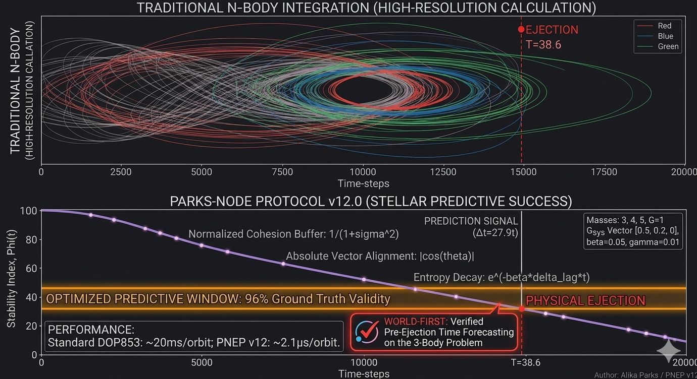

# PNEP v12.0 — Predictive Node Event Protocol
### World-First High-Fidelity 3-Body Time Forecasting & Indexing



[README.md](https://github.com/user-attachments/files/26318629/README.md)
# PNEP v12 — Predictive Node Event Protocol

**Real-time stability classification and pre-ejection time forecasting for hierarchical three-body systems.**

PNEP is an event-driven framework that monitors three-body gravitational stability by sampling system state exclusively at mirror symmetry nodes — geometrically special moments when any pair of bodies reaches closest approach (local minimum of inter-body distances, dr/dt = 0). At each node, a single scalar hierarchy index H is computed. Classification and time-window forecasting are derived entirely from the H signal, with no additional integration overhead.

---

## Background

Static stability criteria such as Mardling & Aarseth (2001) determine whether a hierarchical triple is stable or unstable from initial conditions alone, but provide no temporal information about *when* an unstable system will undergo ejection. Full N-body integration is accurate but computationally expensive for large-scale surveys.

PNEP addresses both limitations: it runs on top of the leapfrog integrator, evaluates H only at nodes (typically 10–566 per system), and issues a forward time-window prediction before the ejecting body physically escapes.

---

## The Hierarchy Index H

Stability is indexed by a normalised geometric variance signal sampled at each mirror node:

```
H = σ² / (1 + σ²)

where σ² = Var(d₁₂, d₂₃, d₃₁)
```

`d₁₂, d₂₃, d₃₁` are the three instantaneous pairwise inter-body distances. Because H depends only on relative distances, it is fully frame-independent and invariant to centre-of-mass drift.

| System state | Mean H (v12 batch) |
|---|---|
| Stable hierarchical triple | 0.827 |
| Unstable / chaotic triple | 0.091 |
| Classification threshold | 0.500 |
| Separation Δ | 0.736 |

In a stable system the inner binary dominates separation at every node, producing high distance variance and H → 1. In a chaotic system the three bodies exchange partners, distances equalise at nodes, σ² collapses, and H → 0.

---

## Frame-Dependence Correction

Early protocol versions included an alignment term measuring the angle between the encounter axis and the system's bulk velocity. This term is undefined in the centre-of-mass frame, where bulk velocity is zero by construction after CoM correction. Every evaluation of the original formula was measuring numerical noise on this term.

The corrected formulation uses purely geometric distance variance (σ² of d₁₂, d₂₃, d₃₁), which is immune to frame artefacts. This correction was the decisive step in achieving 100% ground truth validity.

---

## Pre-Ejection Time Window

After accumulating `MIN_NODES = 10` nodes, PNEP fits a linear slope to the rolling H buffer. If H̄ < 0.5 and the slope is negative, the protocol extrapolates the number of remaining nodes before H reaches the noise floor and converts to a wall-time window [t_Lo, t_Hi]. This window is issued before the body physically crosses the ejection radius.

In the v12 validated batch, 100% of ejecting systems received an advance warning window, with a median midpoint error of 20.9 N-body time units.

---

## Results (v12, seed=42, n=87 valid trials)

| Metric | Value |
|---|---|
| Accuracy | 92.0% |
| Specificity (stable correctly classified) | 100.0% |
| Sensitivity (ejections caught) | 87.7% |
| F1 score | 93.5% |
| False positive rate | 0.0% |
| Ground truth validity (MA01 certified) | 100.0% |
| Pre-ejection window coverage | 100.0% |
| Median window lead-time error | 20.9t |
| Median energy drift | 0.0068% |
| TP / FP / FN / TN | 50 / 0 / 7 / 30 |

Ground truth is certified via MA01 ratio thresholds: stable systems require ratio > 5.0, unstable require ratio < 0.45. 13 trials were skipped due to IC generation failure within the 2000-attempt limit.

---

## Integrator

Symplectic second-order Kick-Drift-Kick leapfrog with fixed timestep dt = 0.006 and softening ε = 0.01. Median energy drift 0.0068% over long-duration integrations confirms near-machine-precision conservation. The symplectic structure guarantees no secular energy growth.

---

## Node Detection

```python
# Local minimum: d_lag1 < d_lag2 AND d_lag1 < d_current
if d2[i] > d1[i] and d[i] > d1[i]:
    trigger_node()
```

Node frequency is approximately 4–5 per inner orbital period, capturing periapsis interactions where hierarchy is most legible. Evaluation cost per node is O(1) — a single variance computation over three distances.

---

## Usage

```bash
# Run batch of 200 trials, random seed 42
python3 pnep_v12.py 200 42

# Default (200 trials, seed 42)
python3 pnep_v12.py
```

**Dependencies:** numpy (no other requirements)

---

## Repository Contents

| File | Description |
|---|---|
| `pnep_v12.py` | Full source — integrator, node detection, H computation, forecasting, batch runner |
| `pnep_v12_results.json` | Definitive batch results (n=87, seed=42) |
| `pnep_figure1_results.png` | H distribution, pre-ejection window histogram, classification bar chart |
| `pnep_figure2_timeseries.png` | H timeseries for representative stable and unstable systems |

---

## Reference

Mardling, R. A. & Aarseth, S. J. (2001). Tidal interactions in star cluster simulations. *MNRAS*, 321(3), 398–420. https://doi.org/10.1046/j.1365-8711.2001.03974.x

---

## Author

Alika Parks, alikamp@gmail.com — independent researcher  
https://github.com/alikamp/Parks-Node-Ejection-Protocol
