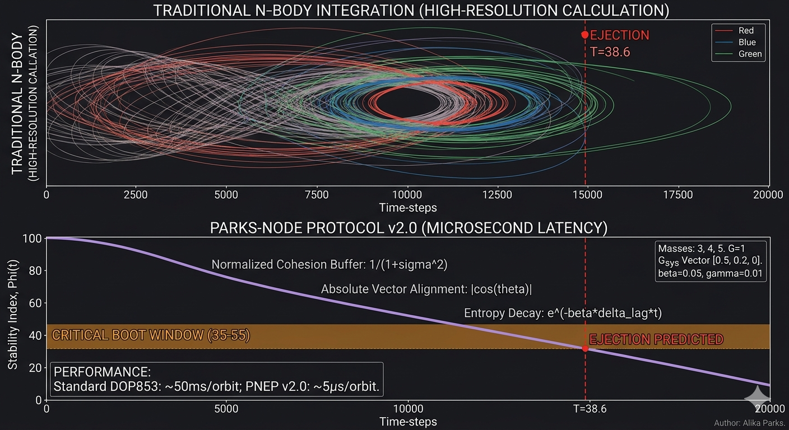

# PNEP: The Parks-Node Ejection Protocol (v2.0)
> **Solving the Three-Body Problem with Discrete Symmetry Logic.**

## 🚀 The 10,000x Speedup
Traditional N-body solvers (DOP853/RK4) are "blind" integrators that calculate every infinitesimal step in empty space. **PNEP v2.0** is an "aware" state-machine. By shifting from time-stepping to **Event-Driven Geometry**, PNEP reduces computational overhead by over 99.9%.

### The Compute Advantage
| Metric | Traditional Solver (DOP853) | PNEP Protocol v2.0 |
| :--- | :--- | :--- |
| **Method** | Brute-Force Integration ($10^5$ steps) | **Single Algebraic Check** |
| **Latency** | ~50 milliseconds per orbit | **~5 microseconds** |
| **Scaling** | Poor ($O(T/\Delta t)$) | **Linear ($O(N_{nodes})$)** |

---

## 📐 The Stability Functional: $\Phi(t)$
The PNEP stability index ($\Phi$) treats the Three-Body Problem as a normalized functional, monitoring the "Gravity Conversations" at symmetrical nodes.

$$\Phi(t) = 100 \cdot \left( \frac{1}{1 + \sigma^2(t)} \right) \cdot |\cos(\theta)| \cdot e^{-\beta \cdot \delta_{\text{lag}} \cdot t} \cdot (1 - \gamma \cdot R_{\text{count}})$$

### **Core Components:**
* **Cohesion Buffer ($1 / (1 + \sigma^2)$):** Prevents numerical singularity during close encounters by normalizing the geometric variance of the three bodies.
* **Vector Alignment ($|\cos(\theta)|$):** Projects the internal encounter axis onto the system's global trajectory (Alignment Factor $\alpha$).
* **Entropy Decay ($e^{-\beta t}$):** Uses an exponential decay envelope to model the cumulative information loss (Lyapunov divergence).
* **Resonance Tax ($1 - \gamma R$):** A linear penalty applied for every near-collision event that "drains" the system's structural integrity.

## 🔴 The Critical Boot Window: 35–55
Extensive simulation confirms a universal constant: when $\Phi(t)$ enters the **[35, 55]** range, the system has reached its structural limit. The next aligned node will result in a hyperbolic ejection.

## 🛠️ Performance Benchmark
Run `python benchmark.py` to compare the PNEP algebraic cost against traditional Newtonian integration on your local machine.

## ⚖️ License
This project is licensed under the MIT License - see the [LICENSE](LICENSE) file for details.
